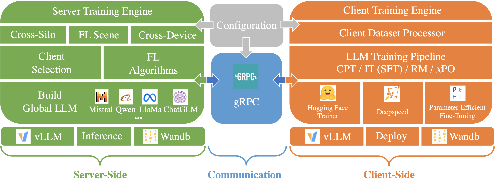

<h1 align="center">  
    <p> F4LLM </p>  
</h1>  
 
 <p align="center"> 
	 
	 
	 
 </p>
 
[//]: # (<h3 align="center">  )

[//]: # (    <p> A Comprehensive Toolkit for Large Language Models in Federated Learning </p>  )

[//]: # (</h3>  )

<p align="center">

</p>

## Abstract
The rapid success of Large Language Models (LLMs) has unlocked vast potential for AI applications in privacy-sensitive domains. 
However, the traditional centralized training of LLMs poses significant challenges due to privacy concerns regarding collecting sensitive data from diverse sources. 
This paper offers a promising and privacy-enhancing solution for LLMs: collaboratively training LLMs via Federated Learning (FL) across multiple clients, 
eliminating the need for raw data transmission. To this end, we present F4LLM, a new and comprehensive toolbox that supports the entire Federated LLM pipeline, 
from Continuous pre-training to alignment and LLM evaluation. F4LLM employs gRPC as the communication protocol to support various widely-used FL algorithms, 
ensuring efficient development and benchmarking in geo-distributed FL environments. 
Moreover, F4LLM offers both open-form and closed-form evaluation options via the efficient inference tool vLLM. 

## Folder Structure
```grapha  
├── userhome  
│   └── data  
|   |   └── safe_rlhf    
│   ├── pretrained  
│   │   └── nlp  
│   ├── output  
│   └── code  
│       └── f4llm  
```  

This repo should be cloned into f4llm:

```bash  
mkdir userhome  
cd userhome  
mkdir data  
mkdir code  
mkdir pretrain  
cd pretrain 
mkdir nlp  
cd ..  
cd code
git clone https://github.com/iezhuozhuo/f4llm.git
```  

## Usage

### Setup
We recommend that the `python` version of the runtime environment be `3.10+`, and `pytorch` be `2.4+`.
```bash
pip install -r requirements
```

### Run F4LLM with FL algorithms
```bash
bash ./scripts/run.sh {your_file_path}/userhome {code_name} {model_name} fedavg {task_name} {port} {gpu_id}
# example: bash ./scripts/run_all.sh /userhome f4llm tinyllama fedavg safe_rlhf 10001 001
```


## License
[MIT license](https://github.com/iezhuozhuo/f4llm?tab=MIT-1-ov-file#)